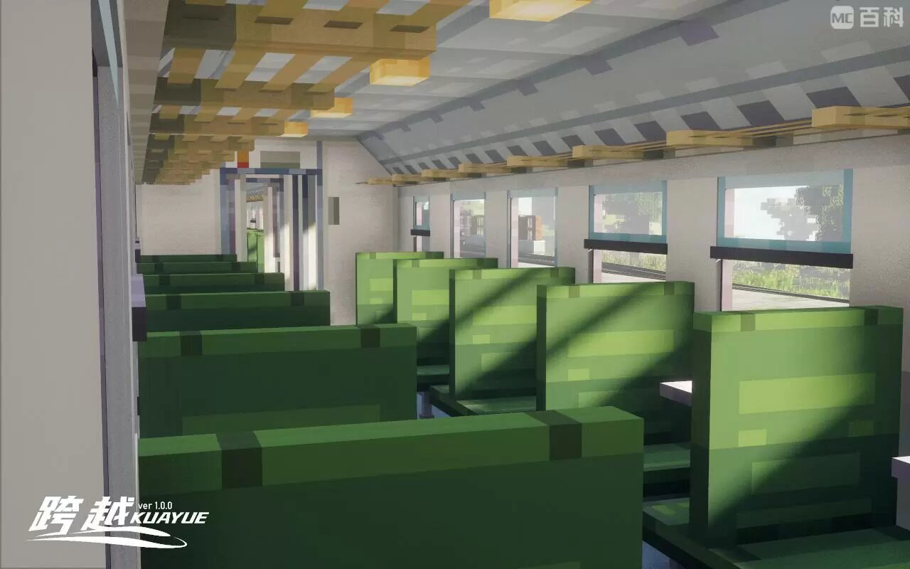
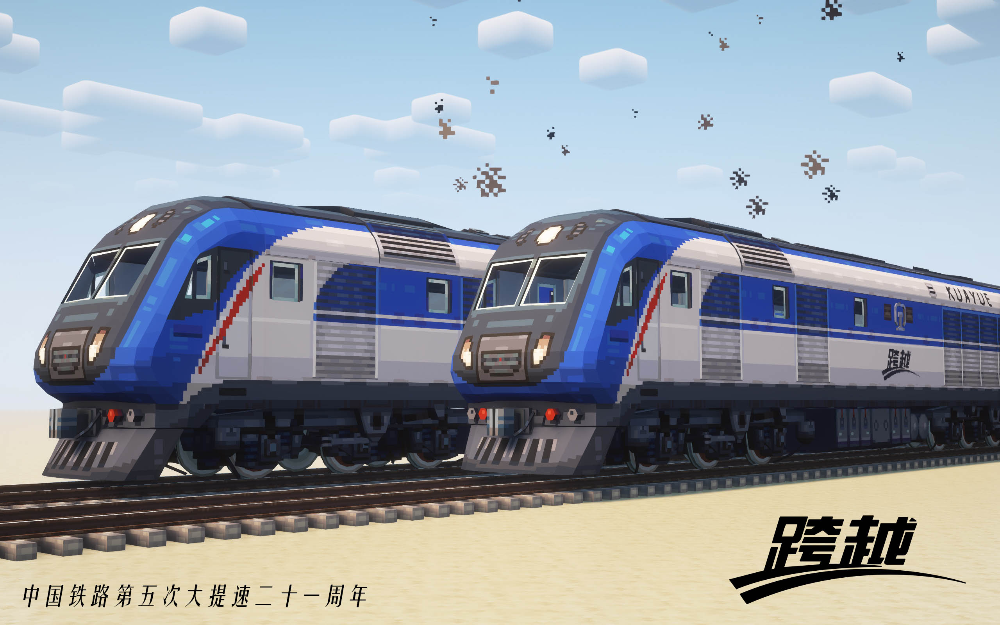
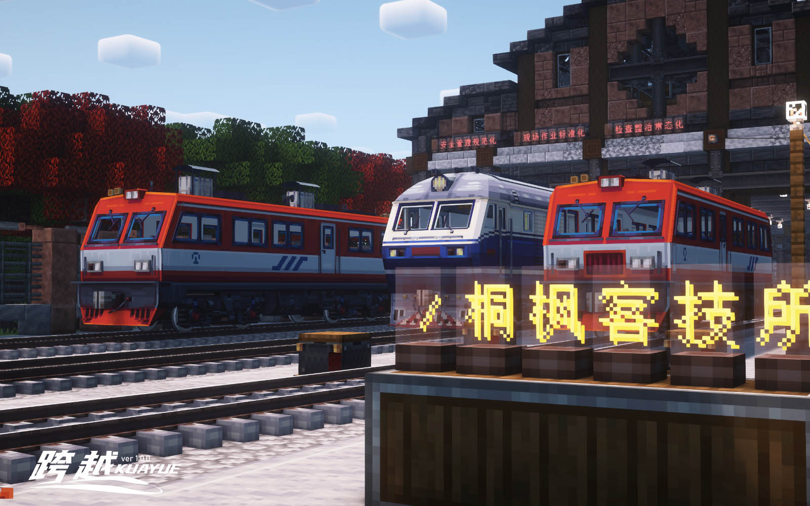
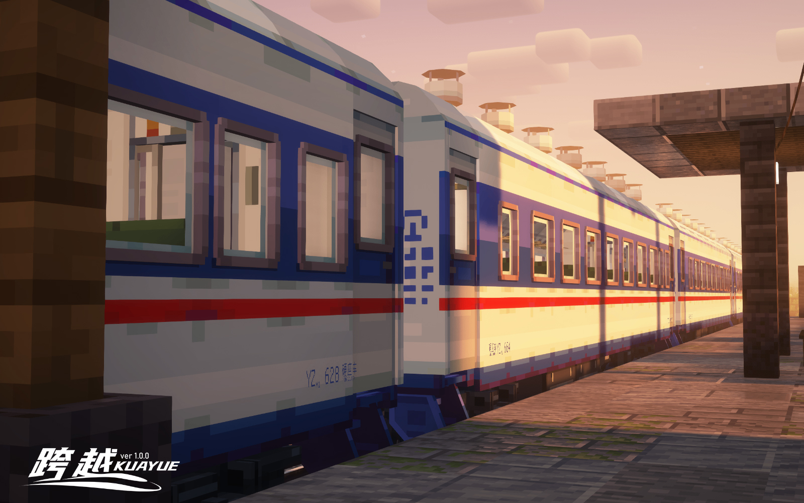
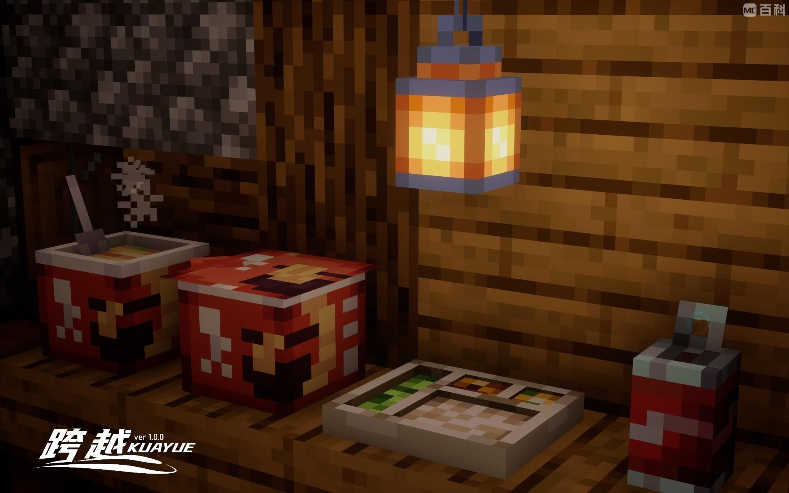

其他语言 | Other languages : <a href="README.md">中文</a>

## Introduction

Kuayue is a Create train mod with Chinese railway style.

As a decorative and functional mod, Kuayue adds locomotives, passenger cars, freight cars, on-board and ground 
equipment that are currently in use or have been retired by the China Railway to the Create train system, and plans to 
implement a set of functional gameplay (such as scheduling, driving, etc.) according to the China Railway specifications.

## Screenshots

## Working Progress

## Development Team

## Special Thanks

## LICENCE

The code of this project is licensed under the MIT License. See [here](./LICENSE) for details.

The art assets and recipe files of this project are licensed under the CC-BY-SA License. 
If you use this mod to make videos or other purposes, please mark this mod in a prominent position (such as the video 
itself, introduction, comment section; while for independent games and software, please place it in the open source 
authorization section and the bottom of the README, etc.), and it is recommended to quote the Github link.

[Creative Commons Attribution-ShareAlike 4.0 International License][cc-by-sa].

